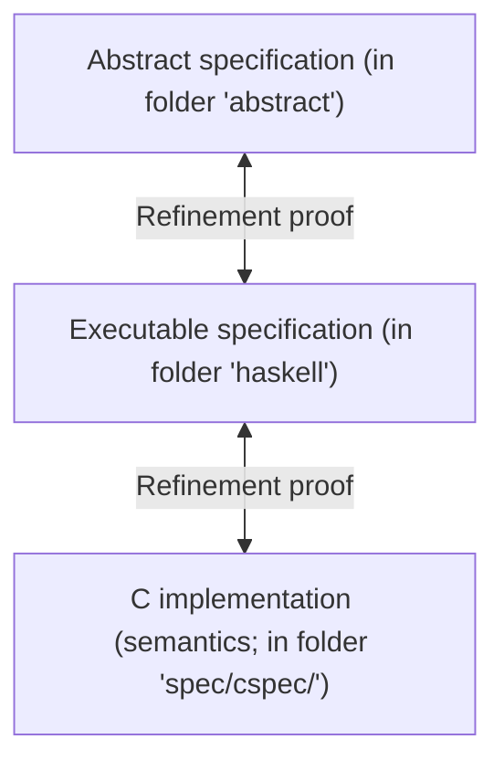

Formal specifications of seL4 (taken from [`L4.verified repo`]([docs/](https://github.com/seL4/l4v)))
-----------------------------------------------------------------------------------------------------

The folder is organised as follows:

* [`abstract`](abstract/): the functional abstract specification of seL4
* [`sep-abstract`](sep-abstract/): an abstract specification for a reduced
  version of seL4 that is configured as a separation kernel
* [`haskell`](haskell/): Haskell model of the seL4 kernel, kept in sync
  with the C code (this is the `executable specification`).
* [`machine`](machine/): the machine interface of these two specifications
* [`cspec`](cspec/): the entry point for automatically translating the seL4 C code
  into Isabelle
* [`capDL`](capDL/): a specification of seL4 that abstracts from memory content and
concrete execution behaviour, modelling the protection state of the
system in terms of capabilities. This specification corresponds to the
capability distribution language *capDL* that can be used to initialise
user-level systems on top of seL4.
* [`take-grant`](take-grant/): a formalisation of the classical take-grant security
  model, applied to seL4, but not connected to the code of seL4.

* There are additional specifications that are not tracked in this repository,
but are generated from other files:
    * [`design`](design/): the design-level specification of seL4,
      generated from the Haskell model.
    * [`c`](cspec/c/): the C code of the seL4 kernel, preprocessed into a form that
      can be read into Isabelle. This is generated from the [seL4 repository](https://github.com/seL4/seL4).
      
### Relation between modules

(graph based on code shared in https://gist.github.com/ChristopherA/bffddfdf7b1502215e44cec9fb766dfd and https://www21.cs.tum.edu/teaching/proof21/SS18/files/14-final.pdf)
